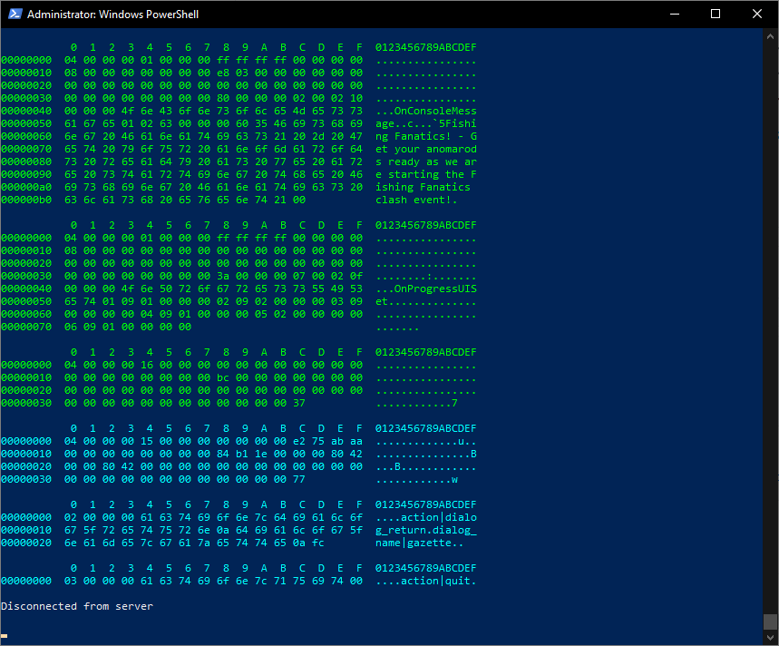

# GrowtopiaPacketReader
A simple script that will print all sent and received packets in Growtopia. This script can be run using [Frida](https://frida.re/). Packets are displayed both in hexadecimal and ASCII. Green text represents incoming packets, cyan text represents outgoing packets. The script will only work on Windows.

### Warning
This might actually be bannable on the newest version of Growtopia. Use it at your own risk!

# How to install

1. [Install Python](https://www.python.org/download/releases/3.0/)
2. Run `pip install frida-tools`
3. Download and extract this repository
4. Open Growtopia
5. Open PowerShell as an administrator and `cd` into the extracted folder
6. Run the following command: `frida Growtopia.exe -l growtopia.js`
7. Now you can play Growtopia as normal and the packets should be displayed

Feel free to open an issue if you have any questions/problems.
